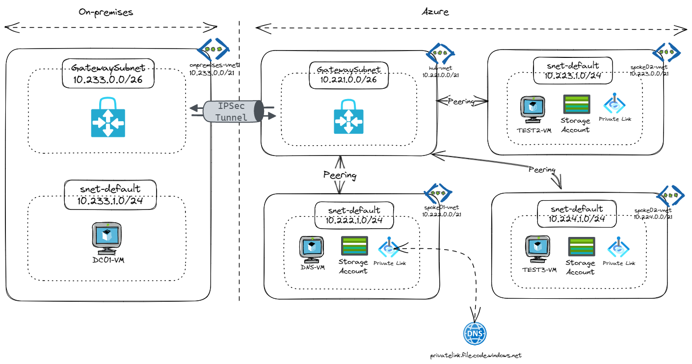

# **Azure Private Link - LAB**
# Contents
## Context
This LAB scenario walks through the use of Azure Private Link with a focus on the required changes needed for DNS.

This lab is not a full explanation of Azure Private Link as a technology, please consider the following articles required pre-reading to build foundational knowledge.

- [Introductory video on Private Link](https://aka.ms/whatisprivatelink) 
- [High level white paper exploring the requirement for Private Link](https://aka.ms/whyprivatelink)

# Pre-requisites

## Overview

In order to use the LAB time most effectively, the following tasks should be completed prior to starting the session.

With these pre-requisites in place, we can focus on building the differentiated knowledge in Private Link that is required when working with the product, rather than spending hours repeating relatively simple tasks such as setting up Virtual Networks and Virtual Machines.

At the end of this section your base lab build looks as follows:

## Task 1 : Deploy Template

We are going to use a predefined Terraform template to deploy the base environment. It will be deployed in to *your* Azure subscription, with resources running in the your specified Azure region.

To start the terraform deployment, follow the steps listed below:

- Login to Azure cloud shell [https://shell.azure.com/](https://shell.azure.com/)
- Ensure that you are operating within the correct subscription via:

`az account show`

- Clone the following GitHub repository 

`git clone https://github.com/bahkuyt/INSOMEA-lab-private-endpoints.git`

- Go to the new folder "INSOMEA-lab-private-endpoints/tf" and initialize the terraform modules

`cd INSOMEA-lab-private-endpoints/tf`

`terraform init`

- Now run apply to start the deployment 

`terraform apply`

- Choose a suitable password to be used for your Virtual Machines administrator account (username: adminuser)

- When prompted, confirm with a **yes** to start the deployment

- Wait for the deployment to complete. This will take around 30 minutes (the VPN gateway takes a while).